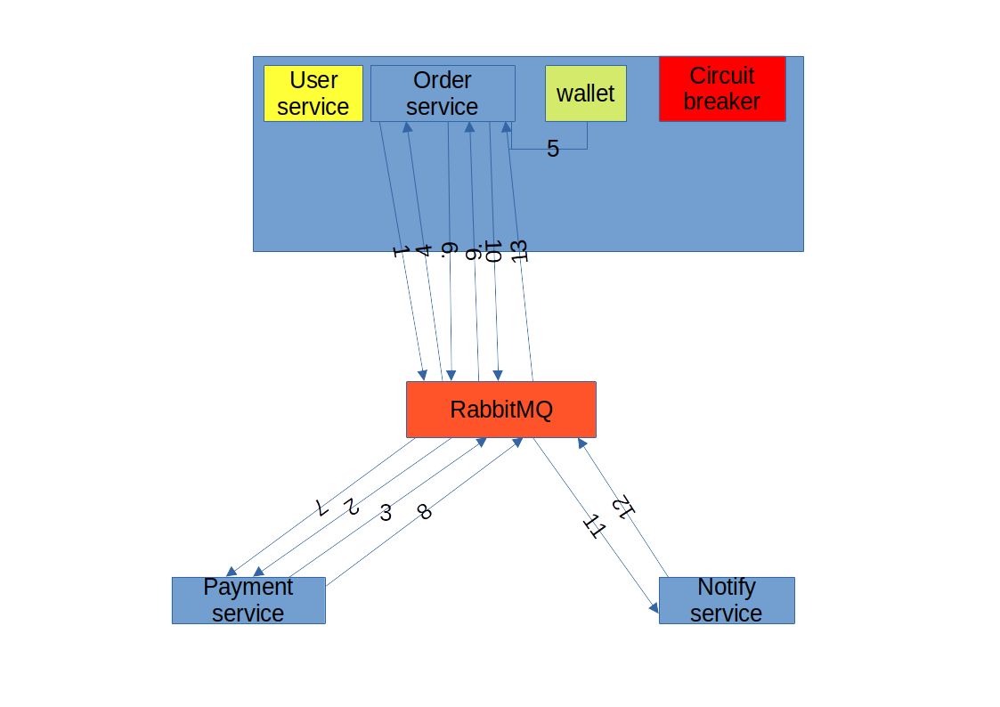

# Project Overview

Welcome to our project! This README provides an overview of the key components and functionalities.

## Applications

1. **Order:**

   - Manages orders.
   - Organizes sagas (consider separating into its own service).
   - Controls a circuit breaker (usually used independently or as a proxy).
   - Interacts with the user's wallet (logically separated).

2. **Payment:**

   - Handles payment processing.

3. **Notify:**
   - Manages notifications.

## System Architecture

1. Order initialization.
2. Order sends order information to Payment service and creates a payment.
3. Payment service informs Order service about the payment.
4. Order service receives payment information.
5. Wallet balance check.
6. Payment service receives confirmation of sufficient funds.
7. Payment execution.
8. Order service receives payment confirmation.
9. Order service logs payment information.
10. Notify service receives payment status information.
11. Email notification.
12. Order service logs shipping information.
13. Saga completion.

## Transaction Safety

Compensating transactions are implemented at each step, ensuring transactional integrity.

## Circuit Breaker Functionality

1. In normal state (IsClose), messages are freely sent to the broker.
2. Upon receiving expired messages, it transitions to Half-Open state, introducing delays before sending.
3. After several cycles of recurring errors in Half-Open state, it transitions to IsOpen state. It stops accepting messages and returns an error until the next cycle.
4. If no errors occur in IsOpen and Half-Open states, it transitions with each cycle to the previous state: IsOpen -> Half-Open -> IsClose.
